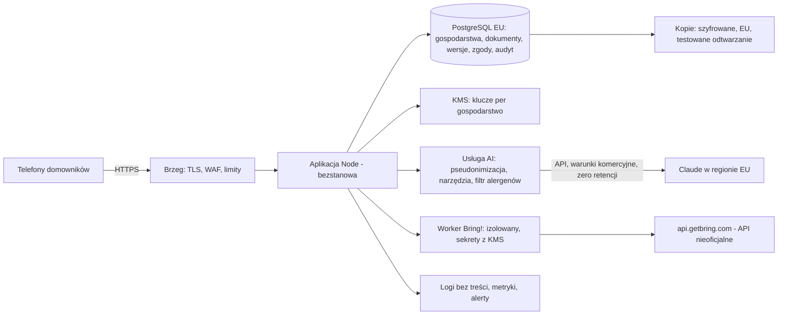

# PrivateChief w sieci: architektura hostowania i zgodność z prawem — analiza z uzasadnieniem

Stan na 2026-09-16. Propozycja do decyzji, nie plan wdrożenia.

## Jak czytać ten dokument

Każdy wniosek w tym dokumencie stoi na trzech nogach i staram się je pokazywać osobno,
żeby dało się sprawdzić, w którym miejscu ewentualnie się mylę:

1. **Fakt o aplikacji** — co kod naprawdę robi i jakie dane naprawdę leżą w plikach.
   To wiem na pewno, bo wynika z kodu; podaję plik i miejsce.
2. **Reguła** — co mówi przepis albo dokumentacja techniczna, własnymi słowami.
   To wiem według stanu na połowę 2026 r.; tam, gdzie mogło się coś zmienić, stoi ⚠.
3. **Zastosowanie** — dlaczego ta reguła łapie ten fakt. To jest moja interpretacja
   i to ją ma sprawdzić prawnik.

Wniosek jest tylko tak dobry, jak najsłabsza z tych trzech nóg. Dlatego przy każdym
ważniejszym twierdzeniu piszę, z czego wynika, zamiast podawać sam wynik.

> To nie jest porada prawna. Regulamin, politykę prywatności i zgody musi przed
> publikacją przejrzeć prawnik. Miejsca oznaczone ⚠ zebrane są w rozdziale 13.

## Słownik pojęć, które się tu powtarzają

- **Dane osobowe** — każda informacja o możliwej do zidentyfikowania osobie. „Zosia,
  7 lat, alergia na orzechy" to dane osobowe, choćby bez nazwiska: w połączeniu z kontem
  rodzica identyfikują konkretne dziecko.
- **Administrator** (art. 4 pkt 7 RODO) — ten, kto decyduje, **po co i jak** dane są
  przetwarzane. Nie ten, kto je wpisuje, tylko ten, kto ustala reguły gry. Właściciel
  usługi, która przetwarza dane jej użytkowników, jest administratorem.
- **Podmiot przetwarzający / procesor** (art. 4 pkt 8) — ktoś, kto przetwarza dane
  **w imieniu** administratora i na jego polecenie: hosting, dostawca poczty, dostawca
  modelu językowego. Wymaga umowy powierzenia (art. 28).
- **Dane szczególnych kategorii** (art. 9) — dane o zdrowiu, przekonaniach religijnych,
  pochodzeniu, orientacji itd. Ich przetwarzanie jest **domyślnie zakazane** i dozwolone
  tylko w wyliczonych wyjątkach. To zmienia wszystko, bo zwykłe dane wolno przetwarzać na
  podstawie umowy, a te — w praktyce konsumenckiej — tylko za wyraźną zgodą.
- **Wyjątek domowy** (art. 2 ust. 2 lit. c) — RODO nie dotyczy tego, co osoba fizyczna
  robi „w ramach czynności o czysto osobistym lub domowym charakterze". Notatki
  o alergiach własnych dzieci to dokładnie to.
- **DPIA** (art. 35) — ocena skutków dla ochrony danych: dokument, w którym administrator
  *przed* rozpoczęciem przetwarzania opisuje ryzyka dla osób i jak je ogranicza.
- **IOD** (art. 37) — inspektor ochrony danych, osoba odpowiedzialna za nadzór nad
  zgodnością; w pewnych sytuacjach obowiązkowa.
- **System AI / dostawca systemu AI** (AI Act, art. 3 pkt 1 i 3) — system, który na
  podstawie danych wejściowych wnioskuje, jak wygenerować wynik (np. zalecenie), oraz
  ten, kto taki system wprowadza na rynek **pod własną nazwą**. Nie trzeba trenować
  modelu, żeby być dostawcą — wystarczy zbudować na cudzym modelu produkt i go wydać.
- **Wyrób medyczny** (MDR, art. 2 pkt 1) — w tym oprogramowanie, jeżeli producent
  **przeznacza** je do celów medycznych: diagnozy, zapobiegania, monitorowania, leczenia.
  O kwalifikacji decyduje deklarowane przeznaczenie, nie technologia.
- **Bezpieczny kontekst** (przeglądarki) — strona pod HTTPS albo `localhost`. Część
  funkcji przeglądarki (m.in. service worker, potrzebny do trybu offline) działa
  wyłącznie w bezpiecznym kontekście. `http://192.168.1.27:8765` nim nie jest.

## 1. Wniosek — i z czego wynika

**Aplikacja w obecnym kształcie nie nadaje się do wystawienia w internecie**, i nie
chodzi o jakość kodu. Chodzi o pięć założeń, które są słuszne dla jednego domu i fałszywe
dla sieci, a każde ma konkretne miejsce w kodzie (rozdz. 4): jeden dom = jedna tożsamość
(PIN), jeden komputer = jedno miejsce na dane, zaufana sieć = brak szyfrowania, prywatny
login Claude Code = silnik czatu, git = historia.

**Jeżeli celem jest nasza rodzina z dowolnego miejsca**, nic z tego nie trzeba zmieniać.
Wystarczy sieć nakładkowa (Tailscale), która sprawia, że telefon w sklepie „jest" w domowej
sieci. Prawo nie wymaga wtedy niczego, bo przetwarzanie danych własnej rodziny dla własnych
potrzeb jest poza RODO (wyjątek domowy — rozdz. 2 wyjaśnia, dlaczego, i gdzie ten wyjątek
się kończy).

**Jeżeli celem jest usługa dla innych rodzin**, to stajemy się administratorem danych
o zdrowiu i danych dzieci (rozdz. 3 pokazuje, że to, co leży w `rodzina/domownicy.md`,
*jest* danymi o zdrowiu w sensie art. 9 — nie z ostrożności, tylko z definicji
i orzecznictwa). Stąd wynikają obowiązki, których nie da się „dopisać na koniec": zgody
odrębne dla każdego dorosłego domownika, DPIA przed startem, rejestr czynności, umowy
z procesorami, region EU dla modelu językowego. Równolegle AI Act robi z nas dostawcę
systemu AI z obowiązkiem przejrzystości — i stawia jedną twardą granicę produktową:
nie wolno nam zbliżyć się do „celu medycznego", bo wtedy przestajemy być aplikacją do
planowania obiadów, a stajemy się wyrobem medycznym z pełnym reżimem wysokiego ryzyka.
Do tego polskie prawo wymaga regulaminu o określonej treści, a prawo konsumenckie
ogranicza, co w tym regulaminie wolno napisać.

**Jest też trzecia droga do „innych rodzin": open source (rozdz. 14).** Publikacja kodu
sprawia, że każda rodzina uruchamia aplikację u siebie, a do mnie nie płynie żaden bajt
jej danych. Wtedy nie jestem administratorem (nie przetwarzam niczego), każda rodzina
jest pod wyjątkiem domowym, a RODO, AI Act, nowa dyrektywa o odpowiedzialności za produkt
i prawo konsumenckie mają wprost zapisane wyłączenia dla niekomercyjnego wolnego
oprogramowania. Cena: granica „niekomercyjne" jest twarda, a to repozytorium w obecnej
postaci nie nadaje się do publikacji, bo zawiera rodzinę.

**Rekomendacja:** zrobić wariant rodzinny teraz (1–2 dni, rozdz. 5). Jeśli celem jest
dać to innym rodzinom — open source (rozdz. 14) jest nieporównanie tańszy prawnie
i technicznie niż usługa. Wariant usługi traktować jako osobny projekt z osobną decyzją;
rozdziały 6–10 opisują go w pełni, żeby decyzja zapadła ze świadomością kosztu, a nie
po fakcie.

## 2. Pytanie o adresata: dlaczego wszystko zależy od odpowiedzi

### Reguła

RODO stosuje się do przetwarzania danych osobowych (art. 2 ust. 1), ale **nie** do
przetwarzania „przez osobę fizyczną w ramach czynności o czysto osobistym lub domowym
charakterze" (art. 2 ust. 2 lit. c). Motyw 18 doprecyzowuje dwie rzeczy: że chodzi
o czynności „bez związku z działalnością zawodową lub handlową", i — to jest kluczowe
zdanie — że **rozporządzenie ma zastosowanie do administratorów lub podmiotów
przetwarzających, którzy udostępniają środki przetwarzania danych osobowych na potrzeby
takich czynności**.

Prosty przykład tej logiki: album ze zdjęciami rodziny w serwisie społecznościowym jest
czynnością domową użytkownika, ale serwis, który ten album przechowuje, podlega RODO
w całości. Użytkownik jest poza rozporządzeniem; dostawca środków — nie.

### Zastosowanie

- Gdy uruchamiam PrivateChief dla własnej rodziny, na własnym komputerze, nie ma tu
  nikogo, kto „udostępnia środki" komuś innemu. Jestem osobą fizyczną robiącą notatki
  o własnym domu. Wyjątek domowy obejmuje wszystko, także dane gości — dopóki to
  faktycznie prywatna czynność.
- Gdy ten sam program udostępniam **innym rodzinom**, jestem dokładnie tym „administratorem
  udostępniającym środki" z motywu 18. To, że dane wpisują sami użytkownicy o sobie,
  nie ma znaczenia — tak samo wpisują je do albumu ze zdjęciami.

### Wniosek

Nie ma wariantu pośredniego. Albo aplikacja służy jednej rodzinie (i wtedy prawo ochrony
danych nie nakłada obowiązków), albo służy obcym (i wtedy nakłada wszystkie). Dlatego
dokument rozdziela wariant A i B, a nie proponuje „trochę zgodności". Wariant C — open
source — jest w istocie wariantem A pomnożonym przez liczbę rodzin: każda uruchamia
program u siebie i każda jest pod wyjątkiem domowym, a ja nie przetwarzam niczego
(rozdz. 14).

| | A: nasza rodzina, zdalnie | B: usługa dla innych rodzin | C: open source |
|---|---|---|---|
| Kto przetwarza dane | rodzina, dla siebie | operator usługi = administrator | każda rodzina, dla siebie; autor kodu nie przetwarza nic |
| RODO | wyjątek domowy | pełne stosowanie, dane art. 9, dzieci | wyjątek domowy u każdej rodziny; autor poza RODO, dopóki nic do niego nie płynie |
| Regulamin | niepotrzebny | obowiązkowy (rozdz. 9) | licencja zamiast regulaminu |
| AI Act | brak obowiązków po stronie rodziny | operator jest dostawcą systemu AI (rozdz. 8) | wyłączenie dla wolnego oprogramowania (art. 2 ust. 12) i dla użytku osobistego (art. 2 ust. 10) |
| Zmiany w kodzie | prawie żadne | przebudowa (rozdz. 6) | rozdzielenie kodu od danych, nowe repozytorium, dokumentacja |
| Czas | 1–2 dni | miesiące, prawnik, DPIA | weekend + przegląd licencji |

## 3. Co aplikacja naprawdę przetwarza — i dlaczego to są dane o zdrowiu

### Fakty

Nie opieram tego na deklaracjach, tylko na tym, co skill każe zapisywać. Szablon
`rodzina/domownicy.md` w `SKILL.md` ma pola: „Dieta / ograniczenia", „Alergie
i nietolerancje" (przykład: „laktoza — lekka, twarde sery OK"), „Cele / uwagi",
„Energia" (kcal na dobę z datą i celem: „utrzymanie masy"), wiek dzieci („Zosia, 7 lat"),
nieobecności („Zosia u dziadków w soboty"). Skill nakazuje traktować „wykluczenia
medyczne/religijne" jako ograniczenia twarde. Do oszacowania zapotrzebowania skill prosi
o płeć, wiek, wzrost, masę ciała i aktywność (Mifflin-St Jeor). Oceny dań trafiają do
`rodzina/historia.md`. Każdy przepis tygodnia niesie ślad tych danych („bez orzechów dla
Zosi"). Hasło do Bring! leży czystym tekstem w `mcp/bring/credentials.json`. Rozmowy
z czatem (`claude -p --resume`, `web/czat.js:160`) Claude Code zapisuje jako transkrypty
w `~/.claude/projects/` na komputerze. Git trzyma każdą wersję każdego pliku.

### Reguła: co jest „daną dotyczącą zdrowia"

Art. 4 pkt 15 RODO: dane osobowe „o zdrowiu fizycznym lub psychicznym osoby fizycznej
[…] ujawniające informacje o stanie jej zdrowia". Motyw 35 dodaje, że chodzi o informacje
o **przeszłym, obecnym lub przyszłym** stanie zdrowia, w tym o chorobie,
niepełnosprawności, ryzyku choroby.

Do tego orzeczenie TSUE w sprawie **C-184/20** (2022): dane, z których informację
szczególnej kategorii da się **wywnioskować pośrednio**, też podlegają art. 9. W tamtej
sprawie chodziło o imię partnera ujawniające orientację; zasada jest ogólna.

### Zastosowanie — kategoria po kategorii

| Dane | Kwalifikacja | Dlaczego |
|---|---|---|
| Alergie, nietolerancje | zdrowie, art. 9 | alergia to stan zdrowia wprost; nietolerancja laktozy to rozpoznanie |
| „Dieta bezglutenowa", „bez cukru", „lekkostrawna" | zdrowie, art. 9 (pośrednio) | z diety leczniczej wynika choroba — C-184/20 |
| Masa ciała, wzrost, cel „redukcja / utrzymanie" | zdrowie, art. 9 | masa ciała w kontekście celu wagowego ujawnia stan zdrowia (nadwaga, niedowaga); sama liczba kcal bez kontekstu byłaby dyskusyjna, ale tu kontekst jest zapisany w tym samym polu |
| Koszer, halal, posty | przekonania religijne, art. 9 | wprost z listy art. 9 ust. 1; skill sam nazywa je „wykluczeniami religijnymi" |
| „Wegetarianin" | granica | może być światopoglądem (art. 9) albo smakiem; ostrożnie: traktować jak art. 9 |
| „Nie je grzybów", „lubi ostre", oceny dań | zwykłe dane | ale jako zbiór opisują styl życia — istotne dla oceny ryzyka w DPIA |
| Wiek dziecka, imię | zwykłe, ze szczególną ochroną | motyw 38: dzieci zasługują na szczególną ochronę; art. 8 (rozdz. 7) |
| Nieobecności („u dziadków w soboty") | zwykłe | nie art. 9, ale informacja, kiedy kogo nie ma w domu — ryzyko bezpieczeństwa fizycznego, do uwzględnienia w DPIA |
| Hasło do Bring! | dane uwierzytelniające | art. 32 wymaga zabezpieczeń „odpowiednich do ryzyka"; jawne hasło do cudzej usługi trudno obronić |
| Transkrypty czatu | wszystko powyższe naraz | zawierają dosłownie te same informacje, tylko w rozmowie; leżą poza aplikacją, bez retencji |
| Historia gita | kopia wszystkiego | każda wersja profilu dziecka zostaje na zawsze — problem przy prawie do usunięcia (rozdz. 4) |

### Dlaczego to ma znaczenie

Art. 9 ust. 1 **zakazuje** przetwarzania tych danych. Ust. 2 wylicza wyjątki. Trzeba więc
przejść przez listę i sprawdzić, który pasuje do aplikacji sprzedawanej rodzinom:

- lit. a — **wyraźna zgoda** osoby, której dane dotyczą: pasuje;
- lit. b (zatrudnienie, zabezpieczenie społeczne), lit. c (interesy życiowe osoby
  niezdolnej do zgody), lit. d (fundacje, związki), lit. e (dane upublicznione przez osobę),
  lit. f (roszczenia), lit. g (ważny interes publiczny z ustawy): nie pasują;
- lit. h — opieka zdrowotna: **nie pasuje**, bo ust. 3 wymaga, żeby dane przetwarzał ktoś
  związany tajemnicą zawodową (lekarz, dietetyk kliniczny w podmiocie leczniczym).
  Aplikacja do planowania obiadów tym nie jest.

Zostaje zgoda. A zgoda ma własne wymagania (art. 4 pkt 11, art. 7): dobrowolna,
konkretna, świadoma, jednoznaczna, dla art. 9 — **wyraźna** (osobne, aktywne działanie,
np. odrębne pole z dokładnym opisem), odwoływalna równie łatwo, jak została wyrażona.
Art. 7 ust. 4 dodaje: jeżeli usługa jest **uzależniona** od zgody na dane, które nie są
do niej niezbędne, zgoda może nie być dobrowolna. Stąd praktyczny wniosek dla produktu:
musi istnieć realny tryb „bez danych o zdrowiu" (same preferencje), inaczej zgoda jest
wątpliwa.

## 4. Kod: co, gdzie i dlaczego nie nadaje się do sieci

Żadna z poniższych pozycji nie jest błędem. Wszystkie były dobrymi decyzjami dla jednego
domu za routerem. Piszę, dlaczego każda przestaje być dobra, gdy za drzwiami jest internet.

### PIN i ciasteczko

**Fakt.** PIN to cztery cyfry losowane przy pierwszym starcie
(`crypto.randomInt(1000, 10000)`, `web/app.js:50`). Po podaniu PIN-u przeglądarka dostaje
ciasteczko `pc_auth` na rok; jego wartość to `sha256(pin + ':' + sekret)`
(`web/app.js:65`) — **taka sama dla każdego urządzenia**. Ciasteczko jest ustawiane bez
atrybutów `Secure` i `HttpOnly` (`web/app.js:1436`). Nie znalazłem w kodzie ograniczenia
liczby prób logowania.

**Reguła.** Cztery cyfry to 10 000 kombinacji. Program zgadujący 100 prób na sekundę
przejdzie wszystkie w niecałe dwie minuty. Brak `HttpOnly` oznacza, że skrypt na stronie
może odczytać ciasteczko (przy ataku XSS wystarczy wykraść je raz — jest jedno na cały
dom). Brak `Secure` oznacza, że przeglądarka wyśle je także po zwykłym HTTP, więc na
współdzielonym Wi-Fi da się je podsłuchać. Art. 32 RODO wymaga środków „odpowiednich do
ryzyka"; przy danych o zdrowiu poprzeczka jest wysoko.

**Zastosowanie.** W domu PIN jest ochroną przed przypadkowym wejściem, nie przed
napastnikiem — żeby próbować, trzeba być w sieci domowej. W internecie próbować może
każdy. Jeden wspólny token oznacza też, że nie da się odebrać dostępu jednemu telefonowi
(np. zgubionemu) bez zmiany PIN-u wszystkim, ani przypisać czynności do osoby.

**Wniosek.** W wariancie A wystarczą trzy poprawki (rozdz. 5). W wariancie B PIN nie może
być tożsamością — potrzebne są konta osobowe; PIN może zostać jako „szybkie odblokowanie"
już zalogowanego urządzenia, jak w aplikacjach bankowych.

### HTTP bez szyfrowania

**Fakt.** Serwer słucha na `0.0.0.0:8765` po zwykłym HTTP. **Reguła.** Bez TLS wszystko —
PIN, ciasteczko, treść przepisów, wiadomości do czatu — idzie jawnym tekstem przez każdą
sieć po drodze. **Zastosowanie.** W domowym Wi-Fi to akceptowalne; poza nim nie.
**Wniosek.** HTTPS w obu wariantach: w A daje go VPN, w B — brzeg z certyfikatem.

### Jeden najemca

**Fakt.** Dane leżą w katalogach projektu, stan w jednym `dane/`, historia w jednym
repozytorium; `lib/uklad.js` zna jeden `ROOT`. **Reguła.** Izolacja danych między
klientami usługi jest podstawowym wymaganiem bezpieczeństwa (art. 32 wymienia wprost
poufność i integralność). **Zastosowanie.** Nie ma tu żadnej granicy między rodzinami,
bo nigdy nie miało być więcej niż jedna — jedna pomyłka w ścieżce dałaby cudze dane.
**Wniosek.** W B gospodarstwo domowe musi być pojęciem w modelu danych, nie katalogiem.

### Czat na prywatnym loginie Claude Code

**Fakt.** `web/czat.js` uruchamia `claude -p` z `--permission-mode acceptEdits`
(`web/czat.js:157`) i `--resume` (`:160`), na koncie, na które właściciel komputera
zalogował się poleceniem `claude` + `/login`. Granicą bezpieczeństwa jest lista
dozwolonych ścieżek w `web/czat-uprawnienia.json`. Każda wiadomość to nowy proces
i nowy start serwera MCP.

**Reguła.** Subskrypcja Claude (Pro/Max, z której korzysta Claude Code) jest licencją
konsumencką dla osoby, na jej własny użytek. Świadczenie na niej usługi osobom trzecim
wymaga API na warunkach komercyjnych. ⚠ Dokładne brzmienie warunków sprawdzić — ale jest
drugi, ważniejszy powód, niezależny od brzmienia: umowa powierzenia (DPA), której
wymaga art. 28 RODO od każdego procesora, jest częścią oferty **komercyjnej** Anthropic,
nie konsumenckiej. Bez umowy komercyjnej nie ma procesora, a bez procesora nie ma
legalnego przetwarzania danych o zdrowiu przez model.

**Zastosowanie.** Lista ścieżek jest dobrą granicą na jednym komputerze, bo chroni
katalog `mcp/` i `web/` przed czatem. W usłudze wielu rodzin granica musi przebiegać
między gospodarstwami, a tego lista ścieżek nie zrobi. Do tego koszt: proces na
wiadomość skaluje się liniowo z liczbą użytkowników.

**Wniosek.** W B: osobna usługa AI wołająca API z narzędziami zawężonymi do danych jednego
gospodarstwa (rozdz. 6). W A: bez zmian.

### Hasło do Bring!

**Fakt.** `mcp/bring/credentials.json` zawiera e-mail i hasło czystym tekstem. Sesja
z `bringauth` żyje ok. godzinę (`expires_in`, `mcp/bring/bring.js:126`) i po wygaśnięciu
kod loguje się ponownie **hasłem** (`bring.js:140`); ewentualnego refresh tokenu z
odpowiedzi nie używa. **Reguła.** Art. 32 — patrz wyżej. Poza tym hasło to hasło do
*cudzej* usługi: jego wyciek to nie tylko nasze naruszenie, ale i przejęcie konta
użytkownika w Bring!. **Zastosowanie.** Na jednym komputerze, za szyfrowaniem dysku, to
jest do obrony. W usłudze przechowującej hasła setek osób — nie. **Wniosek.** W B: tylko
token sesji, a jeśli Bring! nie daje refresh tokenu (⚠ sprawdzić odpowiedź `bringauth`),
hasło zaszyfrowane kluczem gospodarstwa w KMS i jawna informacja dla użytkownika, że je
przechowujemy.

### Git jako historia

**Fakt.** Czat commituje po każdej turze, książka po każdej zmianie; repozytorium trzyma
każdą wersję każdego pliku. **Reguła.** Art. 17 RODO daje prawo do usunięcia danych „bez
zbędnej zwłoki". Git jest zaprojektowany tak, żeby historia była niezmienna: usunięcie
pliku dodaje nowy commit, ale stara treść pozostaje dostępna w poprzednich. Prawdziwe
usunięcie wymaga przepisania historii, co zmienia identyfikatory wszystkich późniejszych
commitów i musi objąć wszystkie kopie. **Zastosowanie.** Dla jednej rodziny to nie
problem — to jej własna historia. W usłudze: „usuń dane naszego gościa Jasia" oznaczałoby
przepisywanie historii gospodarstwa za każdym razem. **Wniosek.** W B: tabela wersji
w bazie, gdzie historia zmian zostaje, ale pojedynczą wersję da się zredagować
albo wymazać.

### Transkrypty czatu poza aplikacją

**Fakt.** Claude Code zapisuje sesje w `~/.claude/projects/…/*.jsonl` w katalogu domowym
właściciela komputera; aplikacja o nich nie wie, nie ma nad nimi retencji ani usuwania.
**Reguła.** Administrator odpowiada za dane wszędzie tam, gdzie je faktycznie ma
(zasada rozliczalności, art. 5 ust. 2), a art. 5 ust. 1 lit. e wymaga ograniczenia
przechowywania. **Wniosek.** W B rozmowy muszą być przechowywane przez aplikację, per
gospodarstwo, z retencją i usuwaniem; w A warto po prostu wiedzieć, że tam leżą.

### Nieoficjalne API Bring!

**Fakt.** Serwer używa `api.getbring.com/rest/v2/` z kluczem odczytanym z aplikacji
webowej Bring! — interfejsu, którego Bring! nie publikuje. **Reguła.** To ryzyko
kontraktowe (regulamin Bring! może zakazywać automatyzacji; ⚠ sprawdzić) i operacyjne
(interfejs może zmienić się lub zniknąć bez ostrzeżenia). **Zastosowanie.** Dla jednej
rodziny: jeśli przestanie działać, wracamy do przepisywania listy. Dla usługi: obietnica
funkcji, której nie kontrolujemy. **Wniosek.** W B integracja opcjonalna, jawnie opisana
jako nieoficjalna, z eksportem listy jako alternatywą zawsze dostępną.

## 5. Wariant A: własna rodzina z dowolnego miejsca

### Dlaczego nie „otworzyć portu na routerze"

Otwarcie portu 8765 wystawiłoby aplikację z czterocyfrowym PIN-em na cały internet
(rozdz. 4). Poza tym wielu operatorów domowych daje adres za tzw. CG-NAT, gdzie
przekierowanie portów w ogóle nie działa. Obie drogi prowadzą do tego samego: potrzebna
jest sieć, w której telefon poza domem widzi komputer w domu, a nikt inny nie widzi nic.

### Dlaczego Tailscale

Tailscale to sieć nakładkowa na WireGuard: każde urządzenie loguje się kontem
(Google/Apple/Microsoft), dostaje prywatny adres i widzi tylko urządzenia tej samej
sieci. Ruch jest szyfrowany od telefonu do komputera; serwer koordynacyjny Tailscale
wymienia klucze i adresy, ale nie widzi treści. Nie trzeba otwierać portów ani
konfigurować routera. Polecenie `tailscale cert` wystawia **prawdziwy certyfikat HTTPS**
(Let's Encrypt) dla nazwy komputera w domenie `*.ts.net`.

To ostatnie ma skutek, który łączy się z pytaniem o tryb offline: przeglądarki
rejestrują service worker — mechanizm, który trzyma kopię stron w telefonie i pozwala
je otworzyć bez sieci — wyłącznie w bezpiecznym kontekście (HTTPS). Pod
`http://192.168.1.27:8765` to niemożliwe; pod `https://komputer.tailnet.ts.net` — tak.
Czyli HTTPS z Tailscale jest warunkiem wstępnym „listy zakupów w sklepie bez zasięgu".

Alternatywy: własny WireGuard na routerze (to samo bez firmy trzeciej, więcej pracy)
albo Cloudflare Tunnel z Access (ruch przechodzi przez Cloudflare; prawnie w wariancie A
obojętne, ale dla danych o zdrowiu wolę nie dokładać pośrednika bez potrzeby).

### Prawnie

Wyjątek domowy. Tailscale jest dostawcą sieci, nie naszym procesorem treści — i tak nie
ma to znaczenia, bo w wariancie A nie jesteśmy administratorem. Regulamin, zgody, DPIA:
nie dotyczą. Jedyna rozsądna praktyka to nie zapisywać o gościach więcej, niż trzeba na
jeden obiad, i nie zostawiać tego na lata.

### Co zrobić przy okazji

Każda z tych rzeczy zamyka konkretną dziurę z rozdz. 4 małym kosztem:

1. `HttpOnly` na ciasteczku (skrypt strony nie może go odczytać) i `Secure` po przejściu
   na HTTPS (nie wyjdzie po HTTP).
2. Limit prób PIN — po pięciu nieudanych minuta przerwy — i ślad w logu.
3. Szyfrowanie dysku (BitLocker) na komputerze z `rodzina/` i `dane/`: kradzież
   laptopa nie może oznaczać wycieku profilu dzieci.
4. Hasło Bring! zaszyfrowane kluczem użytkownika Windows (DPAPI) zamiast jawnego pliku.
5. Kopia zapasowa `dane/` — repozytorium zawiera resztę, `dane/` nie ma żadnej kopii.

## 6. Wariant B: usługa dla innych rodzin — architektura referencyjna

### 6.1 Zasady i skąd się biorą

| Zasada | Skąd |
|---|---|
| **Gospodarstwo domowe jest granicą wszystkiego** — danych, kluczy, narzędzi AI, logów | art. 32 (poufność, integralność); art. 25 (ochrona danych w fazie projektowania); to, że dziś takiej granicy w kodzie nie ma (rozdz. 4) |
| **Dane zostają w EU/EOG** — hosting, kopie, logi, model | rozdział V RODO: każdy transfer poza EOG wymaga podstawy i oceny; brak transferu = brak tego problemu (7.4) |
| **Model językowy dostaje pseudonimy, nie ludzi** | art. 25 i motyw 28 (pseudonimizacja jako środek ograniczający ryzyko); art. 5 ust. 1 lit. c (minimalizacja): do ułożenia planu wystarczy „Dorosły A, alergia: orzechy", imię i waga nie są potrzebne |
| **Twarde ograniczenia egzekwuje kod, nie model** | model językowy jest probabilistyczny — potrafi wpisać orzechy do przepisu „bez orzechów"; anafilaksja to nie jest ryzyko, które wolno zostawić prawdopodobieństwu (rozdz. 11) |
| **Nic nie trafia do planu ani na listę bez akceptacji człowieka** | skill już tak działa („bez wyraźnego »wysyłaj« nic nie wysyłaj"); w usłudze staje się to cechą produktu i argumentem w DPIA, że system wspiera decyzję, a nie ją podejmuje |
| **Markdown zostaje formatem treści** | art. 20 (przenoszalność): eksport konta to archiwum plików czytelnych bez naszej aplikacji — za darmo, bo taki format już mamy |

### 6.2 Składniki

**Brzeg.** TLS 1.2+, HSTS (przeglądarka nigdy nie spróbuje HTTP), CSP (ogranicza skutki
XSS), limity żądań per konto i adres (rozdz. 4: zgadywanie), region EU, bez CDN spoza EU
na ścieżkach z danymi.

**Tożsamość i role.** Konto = osoba, która ukończyła 16 lat (art. 8 — rozdz. 7.3).
Gospodarstwo ma role: *opiekun konta* (zarządza gospodarstwem, profilami dzieci,
integracjami), *dorosły domownik* (własny login, własne zgody), *profil dziecka* (bez
logowania, pod opiekunem), *gość* (tymczasowy, tylko wykluczenia, wygasa sam).
Logowanie: passkeys (WebAuthn) domyślnie — klucz w telefonie, nic do zgadnięcia i nic
do wykradzenia z bazy — magic link na e-mail jako zapas, TOTP dla opiekuna. PIN kuchenny:
odblokowanie już zalogowanego urządzenia.

**Domownicy, którzy nie zakładali konta — dlaczego potrzebny jest osobny mechanizm.**
Fakt: konto zakłada jedna osoba, a alergie wpisuje o współmałżonku. Reguła: zgoda to
„oświadczenie lub wyraźne działanie" **osoby, której dane dotyczą** (art. 4 pkt 11) —
jeden dorosły nie może jej wyrazić za drugiego. Do tego art. 14: jeśli danych nie
pozyskujemy od osoby, musimy ją poinformować. Zastosowanie: klauzula „oświadczam, że mam
zgodę domownika" jest tylko zobowiązaniem umownym użytkownika wobec nas; nie tworzy
zgody w rozumieniu RODO. Wniosek — mechanizm w produkcie: dorosły domownik dostaje
zaproszenie (link/QR), widzi krótką informację i jednym dotknięciem potwierdza profil
oraz zgodę na dane o zdrowiu, bez zakładania pełnego konta. Do tego czasu opiekun może
zapisać o nim tylko preferencje. Dzieci: zgoda rodzica (art. 8 ust. 1), brak celów
kalorycznych poniżej 18 lat — skill już zapisuje „nie liczymy (dziecko)", w usłudze to
zostaje regułą kodu, nie prompta. Goście: wyłącznie lista wykluczeń bez etykiet
medycznych („nie podawać: orzechy"), automatyczne usunięcie po 30 dniach — pozostaje
ryzyko, że wykluczenie pośrednio ujawnia alergię (C-184/20); ograniczamy je krótkim
czasem życia i minimalną treścią, i opisujemy w DPIA.

**Dane.** PostgreSQL w EU. Dokumenty (plan, przepisy, profil) jako treść Markdown
w tabeli z wersjami — historia zostaje, ale każdą wersję da się zredagować albo wymazać
(rozdz. 4: git tego nie umie). Pola o zdrowiu szyfrowane kluczem gospodarstwa (envelope
encryption: dane kluczem gospodarstwa, klucz gospodarstwa kluczem głównym w KMS).
Skutek: zrzut bazy bez KMS jest bezużyteczny, a usunięcie gospodarstwa = zniszczenie
klucza, co **natychmiast** czyni nieczytelnymi także kopie zapasowe — zanim fizycznie
wygasną. To jest odpowiedź na pytanie „jak realizujecie art. 17, skoro macie kopie".

**Usługa AI** — zamiast `claude -p`:

1. Skill staje się promptem systemowym po stronie serwera.
2. Model dostaje spseudonimizowany obraz gospodarstwa: role zamiast imion, przedziały
   wieku, wykluczenia i cele bez danych antropometrycznych. Zapotrzebowanie (Mifflin-St
   Jeor) liczy kod na serwerze; do modelu idzie wynik.
3. Narzędzia modelu to wąskie funkcje nad danymi *tego* gospodarstwa: `czytaj_plan`,
   `zapisz_plan`, `czytaj_przepis`, `zapisz_przepis`, `stan_skladnikow`,
   `dopisz_na_liste`. Bez systemu plików, bez gita, bez Bash. Każde wywołanie
   autoryzowane po gospodarstwie i zapisane w audycie.
4. Wynik przechodzi przez deterministyczny filtr alergenów i kontrolę kalorii (progi
   bezpieczeństwa, brak deficytu dla dzieci), zanim trafi do rodziny.
5. Model przez API na warunkach komercyjnych, z DPA i zerową retencją. Rezydencja w EU:
   Claude przez AWS Bedrock (Frankfurt) albo Google Vertex AI (regiony europejskie) —
   ⚠ dostępność wybranego modelu w regionie; albo API Anthropic z DPA i mechanizmem
   transferu (7.4).
6. Rozmowy per gospodarstwo z retencją (propozycja 90 dni; użytkownik może skrócić
   i usunąć od ręki).

**Bring!.** Worker bez dostępu do bazy dokumentów — dostaje listę pozycji, nic więcej;
skutek: nawet przejęty, nie widzi profili. Sekrety w KMS. Refresh token, jeśli jest
(⚠); jeśli nie — hasło szyfrowane kluczem gospodarstwa z jawną informacją. Integracja
opcjonalna, eksport tekstem zawsze dostępny.

**Obserwowalność.** Logi żądań bez treści: ścieżka, status, czas, identyfikator
gospodarstwa — bez nazw przepisów, bez wiadomości. Dlaczego: logi trafiają do narzędzi
i osób, które nie powinny widzieć danych o zdrowiu, i żyją dłużej, niż ktokolwiek
pamięta. Retencja 30 dni. Alerty na nieudane logowania, błędy AI, awarie Bring!.

**Kopie i cykl życia.** Kopie dzienne, szyfrowane, w EU, z **testowanym** odtwarzaniem
(kopia, której nikt nie odtworzył, nie istnieje). Usunięcie konta: wymazanie
kryptograficzne natychmiast, fizyczne wygaśnięcie kopii w ≤ 30 dni — ten termin ląduje
w polityce prywatności, bo art. 13 wymaga podania okresu przechowywania. Konta nieaktywne
24 miesiące: powiadomienie, po 30 dniach usunięcie (art. 5 ust. 1 lit. e). Eksport:
archiwum Markdown + JSON, samoobsługowo (art. 15 i 20).

**Program bezpieczeństwa** przed startem: model zagrożeń, test penetracyjny, MFA dla
administracji, rotacja sekretów, polityka zależności (dziś zero — warto tego bronić,
bo każda zależność to cudzy kod z dostępem do danych), runbook naruszeń z terminem 72 h
(7.3), DPIA.

### 6.3 Etapy

1. Fundament: model danych z gospodarstwem, tożsamość i role, TLS, audyt.
2. AI przez API: usługa AI z narzędziami, pseudonimizacja, filtr alergenów, retencja.
3. Prawa i zgody: ekrany zgód, zaproszenia domowników, eksport, usuwanie.
4. Bring! jako moduł opcjonalny.
5. Zgodność: DPIA, rejestr czynności, dokumenty (rozdz. 10), test penetracyjny.
6. Start zamknięty (kilka rodzin) → poprawki → start otwarty.

## 7. RODO — obowiązki i skąd każdy wynika

### 7.1 Role i umowy

Reguła: administrator decyduje o celach i sposobach (art. 4 pkt 7); procesor przetwarza
w jego imieniu (pkt 8) i wymaga pisemnej umowy o określonej treści (art. 28 ust. 3).
Zastosowanie: operator jest administratorem danych użytkowników i ich domowników.
Procesorami są: hosting/chmura, dostawca modelu (Anthropic bezpośrednio albo AWS/Google
jako pośrednik), dostawca poczty (magic linki), ewentualne narzędzie do błędów. Z każdym —
DPA; lista trafia do polityki prywatności (art. 13 ust. 1 lit. e: odbiorcy danych).

Bring! **nie jest** procesorem: użytkownik loguje się własnym kontem, a my działamy na
jego polecenie wobec usługi, z którą on ma umowę. To integracja z usługą trzecią,
z odesłaniem do polityki Bring!.

### 7.2 Cele i podstawy prawne

Reguła: każdy cel przetwarzania potrzebuje podstawy z art. 6 ust. 1, a dla danych art. 9
dodatkowo wyjątku z art. 9 ust. 2 (rozdz. 3).

| Cel | Dane | Podstawa | Dlaczego ta |
|---|---|---|---|
| Konto, gospodarstwo, plany, przepisy, lista | zwykłe | art. 6 ust. 1 lit. b (umowa) | niezbędne do wykonania usługi, którą użytkownik zamówił |
| Uwzględnianie alergii, diet medycznych, celów | zdrowie | art. 6 lit. a + art. 9 ust. 2 lit. a — wyraźna zgoda, odrębna, odwoływalna | jedyny wyjątek z art. 9, który pasuje (rozdz. 3) |
| Wykluczenia religijne | przekonania | jw. | jw. |
| Profile dzieci | dane dziecka | zgoda rodzica (art. 8 + art. 9 ust. 2 lit. a) | 7.3 |
| Bezpieczeństwo, logi, ochrona przed nadużyciami | techniczne | art. 6 lit. f (uzasadniony interes) | motyw 49 wymienia bezpieczeństwo sieci wprost |
| Reklamacje, rozliczenia | konta | art. 6 lit. c (obowiązek prawny) | prawo konsumenckie, podatkowe |
| Marketing | — | wyłącznie odrębna zgoda; **nigdy** na danych o zdrowiu | art. 9 nie ma wyjątku dla marketingu |

### 7.3 Obowiązki, które na pewno wystąpią

**Dzieci (art. 8).** Reguła: gdy podstawą jest zgoda, a usługa jest oferowana
bezpośrednio dziecku, przetwarzanie jest zgodne z prawem tylko od 16. roku życia
(państwa mogły obniżyć do 13; Polska nie skorzystała — ustawa z 10 maja 2018 r.);
poniżej — zgoda rodzica, a administrator ma „rozsądnie" ją weryfikować (ust. 2).
Zastosowanie: konta tylko 16+, dzieci jako profile pod rodzicem, potwierdzenie roli
rodzica przy zakładaniu profilu.

**DPIA (art. 35).** Reguła: wymagana, gdy przetwarzanie „może powodować wysokie ryzyko",
zwłaszcza przy dużej skali danych szczególnych kategorii (ust. 3 lit. b). Wytyczne
Grupy Roboczej art. 29 (WP248, przyjęte przez EROD) dają dziewięć kryteriów; spełnienie
**dwóch** zwykle oznacza obowiązek. U nas: dane szczególnych kategorii, osoby wymagające
szczególnej ochrony (dzieci), innowacyjne użycie technologii (model językowy), ocena
aspektów osobistych (dopasowanie diety do celów zdrowotnych) — cztery. Wykaz Prezesa
UODO z 2019 r. (⚠ aktualna wersja) wymienia wprost przetwarzanie danych o zdrowiu
z użyciem nowych technologii. Wniosek: DPIA obowiązkowa, przed startem.

**Rejestr czynności (art. 30).** Reguła: zwolnienie dla podmiotów poniżej 250 osób nie
działa, gdy przetwarzanie obejmuje dane szczególnych kategorii (ust. 5). Wniosek:
rejestr wymagany od pierwszego dnia.

**IOD (art. 37).** Reguła: obowiązkowy, gdy główna działalność polega na przetwarzaniu
danych art. 9 „na dużą skalę" (ust. 1 lit. c). Zastosowanie: „główna działalność" —
tak, bo alergie i cele to rdzeń usługi, nie dodatek. „Duża skala" — pojęcie
niezdefiniowane; wytyczne WP243 każą patrzeć na liczbę osób, ilość danych, czas
i zasięg. Kilka rodzin to nie duża skala; kilka tysięcy — dyskusyjne. Wniosek:
wyznaczyć IOD od początku (może być zewnętrzny) — koszt mały, a spór z UODO o „skalę"
kosztowny.

**Informowanie domowników (art. 14).** Reguła: gdy dane pochodzą nie od osoby, informację
trzeba przekazać w rozsądnym terminie, najpóźniej przy pierwszym kontakcie. Zastosowanie:
mechanizm zaproszeń z 6.2 załatwia informację i zgodę jednocześnie.

**Naruszenia (art. 33–34).** Reguła: zgłoszenie do UODO w 72 godziny od stwierdzenia;
gdy ryzyko dla osób jest wysokie — także informacja dla nich (art. 34). Zastosowanie:
przy danych o zdrowiu wysokie ryzyko jest domyślne. Wniosek: runbook (kto, co, w jakiej
kolejności) musi istnieć przed startem, bo 72 godziny mijają szybko.

**Ochrona danych w fazie projektowania (art. 25).** Reguła: środki techniczne
i organizacyjne wbudowane od początku, domyślnie przetwarzać tylko niezbędne dane.
Zastosowanie: pseudonimizacja do modelu, nie pytać o wagę, gdy użytkownik podaje cel
kcal wprost, brak profilowania domyślnie.

**Prawa osób (art. 15–22).** Samoobsługa w aplikacji: dostęp i eksport, sprostowanie,
usunięcie konta, wycofanie zgody bez utraty konta (art. 7 ust. 3). Art. 22 (decyzje
zautomatyzowane wywołujące skutki prawne) nie ma zastosowania — plan obiadów nie
wywołuje skutków prawnych — ale zdanie o tym warto mieć w DPIA, bo o to zapyta każdy
audytor.

### 7.4 Transfery poza EOG

Reguła (rozdział V): dane wolno przekazać do państwa trzeciego tylko na podstawie
decyzji o adekwatności (art. 45), odpowiednich zabezpieczeń jak standardowe klauzule
umowne (art. 46) albo wyjątków (art. 49). Dla USA decyzja o adekwatności z 10 lipca
2023 r. obejmuje firmy certyfikowane w EU–US Data Privacy Framework.

Zastosowanie: API Anthropic bezpośrednio = transfer do USA → ⚠ sprawdzić wpis Anthropic
na liście DPF; jeśli go nie ma — SCC w DPA plus ocena skutków transferu. Droga przez
Bedrock/Vertex w regionie EU: treść zapytań nie opuszcza EU, ale AWS/Google są
procesorami (DPA), a jako firmy amerykańskie podlegają własnemu prawu (CLOUD Act) —
region EU **zmniejsza** ryzyko, nie usuwa go. Dlatego pseudonimizacja nie jest
ozdobnikiem: to ona sprawia, że to, co ewentualnie opuściłoby EU, nie jest już
o konkretnym człowieku. Wniosek: region EU + pseudonimizacja — najprostsze do
obrony w DPIA.

## 8. AI Act — łańcuch kwalifikacji krok po kroku

Rozporządzenie 2024/1689. Każdy krok jest osobną przesłanką; jeśli którykolwiek jest
błędny, wniosek się zmienia — dlatego rozpisuję je osobno.

**Krok 1: czy to system AI?** Art. 3 pkt 1: system maszynowy, który z danych
wejściowych wnioskuje, jak generować wyniki takie jak przewidywania, treści,
zalecenia. Planowanie jadłospisu z profilu i rozmowa w czacie — tak.

**Krok 2: kim jesteśmy?** Art. 3 pkt 3: *dostawca* to ten, kto rozwija system AI lub
zleca jego rozwój i wprowadza go na rynek **pod własną nazwą**. Nie trzeba trenować
modelu. Budujemy produkt na modelu ogólnego przeznaczenia (Claude — art. 3 pkt 63)
i wydajemy go pod nazwą PrivateChief → jesteśmy dostawcą systemu AI. Anthropic jest
dostawcą modelu GPAI z własnymi obowiązkami (art. 53), które nas nie obciążają, dopóki
modelu istotnie nie modyfikujemy (nie modyfikujemy — używamy przez API).

**Krok 3: czy to wysokie ryzyko?** Art. 6 daje dwie drogi:

- ust. 2 i **załącznik III** — lista dziedzin: biometria, infrastruktura krytyczna,
  edukacja, zatrudnienie, dostęp do usług podstawowych (m.in. ubezpieczenia zdrowotne,
  segregacja medyczna w ratownictwie), egzekwowanie prawa, migracja, wymiar
  sprawiedliwości. Planowania żywienia tam nie ma.
- ust. 1 i **załącznik I** — system jest wysokiego ryzyka, jeśli jest produktem (lub jego
  elementem bezpieczeństwa) objętym wymienionymi tam przepisami harmonizacyjnymi
  i podlega ocenie zgodności przez stronę trzecią. Na liście jest rozporządzenie
  o wyrobach medycznych (MDR 2017/745).

Więc jedyna droga do wysokiego ryzyka prowadzi przez pytanie: **czy PrivateChief jest
wyrobem medycznym?**

**Krok 4: czy to wyrób medyczny?** MDR art. 2 pkt 1: wyrobem jest m.in. oprogramowanie
**przeznaczone przez producenta** do celów medycznych — diagnozy, zapobiegania,
monitorowania, przewidywania, leczenia choroby. Wytyczne MDCG 2019-11 potwierdzają:
decyduje przeznaczenie wynikające z deklaracji producenta (opis, marketing, instrukcja),
a aplikacje „lifestyle i wellness" bez celu medycznego wyrobami nie są. Reguła 11
załącznika VIII MDR klasyfikuje oprogramowanie dostarczające informacji do decyzji
diagnostycznych lub terapeutycznych co najmniej jako klasę IIa — a od IIa w górę wymagana
jest jednostka notyfikowana, czyli właśnie „ocena zgodności przez stronę trzecią"
z art. 6 ust. 1 AI Act. Łańcuch się domyka: **cel medyczny → wyrób klasy IIa+ →
jednostka notyfikowana → system AI wysokiego ryzyka**.

**Wniosek z kroków 3–4.** PrivateChief *nie jest* wysokiego ryzyka pod jednym warunkiem:
że nigdzie — w opisie, marketingu, interfejsie, regulaminie — nie deklaruje celu
medycznego. „Układamy jadłospis uwzględniający wpisane przez Ciebie wykluczenia" to nie
cel medyczny. „Dieta przy insulinooporności", „plan dla cukrzyka", „pomagamy leczyć"
— to jest cel medyczny, i wtedy zmienia się wszystko: MDR, jednostka notyfikowana,
pełne obowiązki wysokiego ryzyka (dokumentacja, nadzór człowieka, rejestracja w bazie
UE). To granica produktu, nie prawnicza formalność, i musi być zapisana w backlogu jako
wymaganie: alergie i diety są **deklaracjami użytkownika**, nie rozpoznaniami; szacunek
zapotrzebowania jest **propozycją** z odesłaniem do specjalisty; słowa „leczy",
„terapia", „dla chorych na" nie występują.

**Krok 5: co nas obowiązuje mimo to.**

- **Art. 50 ust. 1 — przejrzystość.** Dostawca systemu przeznaczonego do interakcji
  z ludźmi zapewnia, że ludzie wiedzą, iż rozmawiają z AI (chyba że jest to oczywiste).
  Czat w kuchni, do którego zagląda dziecko albo gość — nie zakładałbym oczywistości.
  Wniosek: stały napis w oknie rozmowy i rozdział w regulaminie. Stosowany od 2 sierpnia
  2026 r. (⚠ rozdz. 13).
- **Art. 4 — kompetencje w zakresie AI.** Dostawcy i użytkownicy systemów zapewniają
  wystarczający poziom kompetencji personelu. Dla nas: krótkie szkolenie i notatka dla
  osób obsługujących wsparcie — od 2 lutego 2025 r.
- **Art. 5 — praktyki zakazane.** M.in. wykorzystywanie podatności ze względu na wiek.
  Dla nas: żadnej grywalizacji nakręcającej dzieci na liczenie kalorii, żadnych „ciemnych
  wzorców" przy zgodach.
- **Dokumentacja techniczna** (art. 11) nas nie obowiązuje, bo dotyczy wysokiego ryzyka —
  ale lekka wersja (opis systemu, dane wejściowe, ograniczenia, testy filtra alergenów)
  służy DPIA i wsparciu, i jest tania, jeśli powstaje na bieżąco.

**Krok 6: terminy** (art. 113; ⚠ zweryfikować):

| Data | Co |
|---|---|
| 2 lutego 2025 | art. 4 (kompetencje), art. 5 (praktyki zakazane) |
| 2 sierpnia 2025 | obowiązki dostawców modeli GPAI (Anthropic) |
| 2 sierpnia 2026 | stosowanie ogólne, w tym art. 50 i załącznik III |
| 2 sierpnia 2027 | wysokie ryzyko z załącznika I (m.in. wyroby medyczne) |

W listopadzie 2025 r. Komisja zaproponowała pakiet „omnibus cyfrowy" przesuwający
część obowiązków dla systemów wysokiego ryzyka do czasu dostępności norm. Nie wiem,
w jakim kształcie został przyjęty — dla nas i tak liczy się art. 50, którego propozycja
nie ruszała.

## 9. Prawo polskie i konsumenckie — dlaczego regulamin i co w nim nie może się znaleźć

**Dlaczego regulamin jest obowiązkowy.** Ustawa o świadczeniu usług drogą elektroniczną
(2002), art. 8 ust. 1: usługodawca **określa regulamin** i udostępnia go nieodpłatnie
przed zawarciem umowy. Ust. 3 wylicza minimalną treść: rodzaje i zakres usług, warunki
świadczenia (w tym wymagania techniczne i zakaz dostarczania treści bezprawnych),
warunki zawierania i rozwiązywania umów, tryb reklamacyjny. Aplikacja webowa dla rodzin
jest usługą świadczoną drogą elektroniczną, więc bez regulaminu nie da się jej legalnie
uruchomić.

**Dlaczego nie wszystko wolno w nim napisać.** Użytkownicy są konsumentami. Trzy
konsekwencje:

1. **Klauzule niedozwolone** (Kodeks cywilny, art. 385¹–385³): postanowienie
   nieuzgodnione indywidualnie, które rażąco narusza interesy konsumenta, **nie wiąże
   go** — a Prezes UOKiK może za jego stosowanie nałożyć karę do 10% obrotu. Art. 385³
   podaje listę typowych: pkt 1 — wyłączenie odpowiedzialności za szkody na osobie;
   pkt 10 — jednostronna zmiana umowy bez ważnej przyczyny wskazanej w umowie; pkt 23 —
   sąd właściwy według siedziby przedsiębiorcy. Każda z nich kusi w regulaminie
   aplikacji z alergiami — i każda jest nieważna.
2. **Ustawa o prawach konsumenta (2014)**, rozdział o treściach i usługach cyfrowych
   (wdrożenie dyrektywy 2019/770, od 1 stycznia 2023 r.): usługa ma być zgodna z umową,
   dostawca ma obowiązek aktualizacji zapewniających zgodność, konsument ma
   uprawnienia przy wadach i prawo odzyskać swoje treści po rozwiązaniu umowy — nasz
   eksport Markdown realizuje to dosłownie.
3. **Prawo komunikacji elektronicznej (2024)** — ciasteczka wymagają zgody, chyba że są
   niezbędne do świadczenia usługi. Ciasteczko sesji jest niezbędne → bez baneru; jeśli
   dojdzie analityka → zgoda.

Do tego: ustawa o ochronie danych osobowych (2018) — próg 16 lat i UODO jako organ; oraz
⚠ likwidacja unijnej platformy ODR (rozporządzenie 2024/3228, platforma wyłączona
w 2025 r.) — wzorce regulaminów w obiegu nadal zawierają obowiązkowy kiedyś link do ODR,
który dziś jest nieaktualny.

## 10. Regulaminy — jak dostosować do tej specyfiki

### 10.1 Komplet dokumentów

| Dokument | Po co | Podstawa |
|---|---|---|
| **Regulamin** | umowa z użytkownikiem | art. 8 u.ś.u.d.e.; ustawa o prawach konsumenta |
| **Polityka prywatności** + **informacja dla domowników** | obowiązek informacyjny wobec użytkownika i wobec osób, których dane wpisał | art. 13 i 14 RODO |
| **Ekrany zgód** (odrębne: zdrowie/religia; dzieci; marketing) | ważność zgody wymaga odrębności i konkretności | art. 7, 8, 9 RODO |
| **Informacja o AI** (rozdział regulaminu + stały element interfejsu) | przejrzystość | art. 50 AI Act |
| **Umowy powierzenia** z procesorami (otrzymujemy i akceptujemy) | procesor bez umowy = nielegalne przetwarzanie | art. 28 RODO |
| Wewnętrzne: rejestr czynności, DPIA, polityka retencji, runbook naruszeń, polityka bezpieczeństwa, notatka o kompetencjach AI | rozliczalność: musimy umieć **wykazać** zgodność, nie tylko jej przestrzegać | art. 5 ust. 2, 30, 35 RODO; art. 4 AI Act |

### 10.2 Regulamin — klauzule specyficzne, z uzasadnieniem

Poniżej wyłącznie to, co jest specyficzne dla tej aplikacji, z propozycją brzmienia do
przeróbki przez prawnika. Język celowo prosty: regulamin czyta rodzic na telefonie,
a klauzula, której konsument nie mógł zrozumieć, jest też słabsza prawnie (art. 385
§ 2 KC — niejednoznaczne postanowienia tłumaczy się na korzyść konsumenta).

**Definicje** (poza standardowymi): *Gospodarstwo* — grupa osób prowadzących wspólny
jadłospis; *Opiekun konta*; *Domownik*; *Profil dziecka* — osoby poniżej 16 lat,
prowadzony przez Opiekuna; *Gość* — profil tymczasowy; *Asystent* — funkcja oparta na
systemie sztucznej inteligencji; *Lista zakupów* — w Bring! lub jako eksport.
Dlaczego: bez tych pojęć nie da się precyzyjnie napisać, kto za czyje dane odpowiada.

**Charakter usługi — nie porada medyczna.** Dlaczego: to jest zapis granicy z rozdz. 8
(cel niemedyczny) i jednocześnie opis usługi wymagany przez art. 8 u.ś.u.d.e. Propozycja:

> Usługa pomaga planować posiłki i zakupy na podstawie informacji, które podajesz. Nie
> jest poradą lekarską ani dietetyczną, nie diagnozuje, nie leczy i nie zastępuje
> konsultacji ze specjalistą. Jeżeli Ty lub Domownik macie chorobę wymagającą diety
> leczniczej, ustalcie ją z lekarzem lub dietetykiem — Usługa może jedynie uwzględnić
> wykluczenia i cele, które sami wpiszecie. Usługa nie jest wyrobem medycznym.

**Asystent AI.** Dlaczego: art. 50 AI Act (informacja o AI), a także wyjaśnienie
ograniczeń, które jest podstawą do rozsądnego podziału odpowiedzialności. Propozycja:

> Asystent to system sztucznej inteligencji. Rozmawiasz z programem, nie z człowiekiem;
> informujemy o tym w oknie rozmowy na stałe. Asystent może się mylić, także co do
> składników i wartości odżywczych. Każdy plan i każda lista zakupów wymaga Twojej
> akceptacji, zanim zostaną zapisane lub wysłane. Treści Asystenta nie są poradą
> medyczną. Nie używamy Twoich rozmów ani danych Gospodarstwa do uczenia modeli.

**Alergeny i ograniczenia.** Dlaczego: podział ról między aplikacją (składniki
w przepisie) a człowiekiem (skład produktu ze sklepu) musi być jasny *przed* szkodą,
a nie w sporze; jednocześnie nie wolno napisać „nie odpowiadamy" (art. 385³ pkt 1 KC).
Propozycja:

> Wykluczenia (alergie, nietolerancje, diety) działają wyłącznie na podstawie tego, co
> wpisałeś, i dotyczą składników wymienionych w przepisach. Usługa nie zna składu
> konkretnych produktów w sklepie ani zanieczyszczeń krzyżowych. Przed podaniem posiłku
> osobie z alergią zawsze sprawdź etykiety produktów. W każdym przepisie pokazujemy,
> jakie wykluczenia zostały uwzględnione — jeśli czegoś brakuje, nie podawaj posiłku
> i zgłoś nam to.

**Dane Domowników — obowiązki Opiekuna.** Dlaczego: art. 4 pkt 11 (zgoda tylko własna)
i art. 14 (informacja) — rozdz. 6.2. Propozycja:

> Wpisując dane innych osób, odpowiadasz za to, że masz do tego prawo. Dorosły Domownik
> sam potwierdza swój profil i zgodę na przetwarzanie danych o zdrowiu — do tego czasu
> możesz zapisać o nim tylko preferencje. Profil dziecka może założyć wyłącznie rodzic
> lub opiekun prawny. Przekaż Domownikom informację o przetwarzaniu (link w aplikacji).

**Wiek.** Dlaczego: art. 8 RODO (16 lat w Polsce) i granica bezpieczeństwa żywieniowego
z rozdz. 11. Propozycja:

> Konto może założyć osoba, która ukończyła 16 lat. Dla dzieci nie ustalamy celów
> kalorycznych ani nie proponujemy diet redukcyjnych — niezależnie od tego, co wpiszesz.

**Integracja z Bring!.** Dlaczego: ryzyko kontraktowe i operacyjne nieoficjalnego API
(rozdz. 4) musi być ujawnione przed skorzystaniem, a przechowywanie cudzych danych
logowania — opisane wprost (art. 13: cel i okres). Propozycja:

> Wysyłka do Bring! jest funkcją dodatkową i korzysta z Twojego konta Bring! na Twoje
> polecenie. Bring! nie udostępnia oficjalnego interfejsu dla takich programów, więc
> funkcja może przestać działać bez uprzedzenia, a korzystanie z niej podlega także
> regulaminowi Bring!. Twoje dane logowania przechowujemy zaszyfrowane wyłącznie po to,
> by wykonać wysyłkę; możesz je usunąć w każdej chwili. Zawsze możesz pobrać listę jako
> tekst.

**Konto i bezpieczeństwo.** Logowanie kluczem dostępu lub linkiem; PIN kuchenny
odblokowuje tylko urządzenie już zalogowane; zakaz udostępniania dostępu osobom spoza
Gospodarstwa; co robimy przy podejrzeniu nieuprawnionego dostępu. Dlaczego: art. 32
(obowiązki po obu stronach) i art. 8 u.ś.u.d.e. (warunki świadczenia).

**Treści użytkownika.** Przepisy i plany należą do użytkownika; licencja dla nas
ograniczona do świadczenia usługi; bez uczenia modeli, bez publikacji. Dlaczego: bez
tej klauzuli status przepisów tworzonych przez Asystenta i poprawianych przez rodzinę
jest niejasny, a „bez uczenia modeli" jest obietnicą, której DPIA i tak wymaga.

**Odpowiedzialność.** Odpowiadamy za niezgodność usługi z umową na zasadach ustawy
o prawach konsumenta; nie odpowiadamy za skutki nieaktualnych lub niepełnych danych
w profilu ani za skład produktów ze sklepu; **nie wyłączamy** odpowiedzialności za
szkodę na osobie ani za winę umyślną. Dlaczego: to jest maksimum, które przejdzie przez
art. 385³ KC; wszystko dalej idące jest nieważne i naraża na karę UOKiK.

**Reklamacje i spory.** Reklamacje mailem, odpowiedź w 14 dni (ustawa o prawach
konsumenta). Pozasądowo: powiatowy rzecznik konsumentów, Inspekcja Handlowa, procedury
UOKiK. ⚠ Bez odsyłania do platformy ODR (rozdz. 9).

**Zmiany regulaminu.** Powiadomienie z wyprzedzeniem (co najmniej 14 dni), prawo
wypowiedzenia bez konsekwencji, brak działania wstecz, ważne powody wymienione
w regulaminie. Dlaczego: art. 385³ pkt 10 KC.

**Rozwiązanie umowy.** Usunięcie konta z aplikacji w każdej chwili; los danych
(wymazanie kryptograficzne natychmiast, kopie ≤ 30 dni); eksport przed i przez 30 dni
po; Gospodarstwo bez Opiekuna wygasa po ustalonym czasie z uprzedzeniem Domowników.
Dlaczego: art. 17 RODO, prawo do zwrotu treści cyfrowych po rozwiązaniu umowy.

### 10.3 Polityka prywatności — czego nie może zabraknąć i dlaczego

Poza standardową treścią art. 13: wyraźne wskazanie, **które** dane są danymi
o zdrowiu i przekonaniach i że przetwarzamy je tylko za zgodą (bo zgoda ma być
świadoma — art. 4 pkt 11); opis pseudonimizacji przed wysłaniem do modelu, **kto** jest
dostawcą modelu i **gdzie** przetwarza (art. 13 ust. 1 lit. e i f: odbiorcy i transfery);
retencja rozmów i sposób ich usunięcia (lit. a ust. 2: okres przechowywania); sposób
informowania Domowników i mechanizm ich zgody; zasady profili dzieci; kopie zapasowe
i termin fizycznego usunięcia; lista procesorów; dane IOD; prawo skargi do Prezesa UODO
(ust. 2 lit. d). Osobna, krótka **informacja dla Domowników** (art. 14), pisana do
osoby, która o usłudze dowiedziała się od kogoś z rodziny — nie do klienta.

### 10.4 Ekrany zgód — jak to ma wyglądać i dlaczego tak

Reguła: zgoda ma być odrębna od innych spraw (art. 7 ust. 2), konkretna co do celu
(art. 4 pkt 11), a dla art. 9 — wyraźna. Pole zaznaczone z góry albo zgoda „w pakiecie"
z regulaminem nie spełnia tych warunków (motyw 32 wprost: milczenie i domyślnie
zaznaczone okienka nie są zgodą).

Trzy rozdzielone decyzje, każda z własnym przełącznikiem, żadna nie zaznaczona z góry:

1. **Regulamin** — akceptacja (podstawa: umowa; to nie jest zgoda w rozumieniu RODO).
2. **Dane o zdrowiu i przekonaniach** — „Zgadzam się, żeby Usługa przetwarzała moje
   alergie, diety i cele żywieniowe, w tym wynikające ze stanu zdrowia lub przekonań, po
   to, by dopasować jadłospis. Mogę wycofać zgodę w ustawieniach — wtedy Usługa działa
   dalej, ale bez tych danych." Ostatnie zdanie jest warunkiem dobrowolności
   (art. 7 ust. 4).
3. **Profil dziecka** — potwierdzenie roli rodzica/opiekuna i zgoda jak wyżej w imieniu
   dziecka (art. 8).

Marketing (jeśli kiedykolwiek) — czwarty, osobny przełącznik, nigdy oparty na danych
o zdrowiu. Każda zgoda zapisana z datą, wersją tekstu i sposobem wyrażenia, bo art. 7
ust. 1 każe administratorowi **wykazać**, że zgoda została wyrażona.

## 11. Bezpieczeństwo żywieniowe — poza RODO i AI Act

To część, którą prawnik może pominąć, a która w praktyce decyduje, czy ktoś się zatruje.
Wnioski wynikają tu nie z przepisów, lecz z natury narzędzia i z odpowiedzialności
cywilnej.

**Alergeny.** Przesłanka: model językowy generuje tekst probabilistycznie i potrafi
umieścić orzechy w przepisie zatytułowanym „bez orzechów" — nie z braku wiedzy, lecz
z natury generowania. Przesłanka druga: skutkiem błędu może być reakcja anafilaktyczna.
Wniosek: wykluczenia zadeklarowane w profilu muszą być sprawdzane **deterministycznie**
na liście składników każdego przepisu, zanim plan trafi do rodziny — i to jest tanie, bo
składniki mamy już w formacie strukturalnym (`- nazwa | ilość | znacznik`, FORMAT.md).
Do tego w każdym przepisie widoczne „wykluczenia uwzględnione: orzechy (Zosia)" i stała
informacja, że skład produktu ze sklepu czyta człowiek. Klauzula w regulaminie nie
zastępuje filtra; filtr nie zastępuje klauzuli.

**Kalorie i dzieci.** Przesłanka: cele kaloryczne i deficyty u osób nieletnich oraz
bardzo niskie cele u dorosłych są ryzykiem zdrowotnym, którego aplikacja bez nadzoru
specjalisty nie powinna wspierać; sygnały zaburzeń odżywiania mogą pojawić się
w rozmowie. Wniosek: kod, nie prompt, egzekwuje brak celów dla osób poniżej 18 lat,
progi bezpieczeństwa dla dorosłych, brak „redukcji" bez potwierdzenia, że cel podał
użytkownik; sygnały zaburzeń w czacie → zatrzymanie i odesłanie do pomocy, nie plan.

**Odpowiedzialność cywilna.** Przesłanka: art. 385³ pkt 1 KC (nie da się wyłączyć
odpowiedzialności za szkodę na osobie) oraz ogólne zasady odpowiedzialności za produkt
i usługę. Wniosek: opisać charakter usługi i obowiązki użytkownika (weryfikacja etykiet,
aktualność profilu), nie udawać, że odpowiedzialności nie ma; rozważyć ubezpieczenie OC
działalności.

## 12. Plan działania

1. **Decyzja A czy B** — reszta zależy od niej (rozdz. 2).
2. **Wariant A (1–2 dni):** Tailscale na komputerze i telefonach, HTTPS z `tailscale
   cert`, ciasteczko z `HttpOnly`/`Secure`, limit prób PIN, BitLocker, kopia `dane/`.
   Potem: service worker i tryb offline w sklepie.
3. **Wariant B — zanim powstanie linijka kodu:** DPIA w wersji roboczej (wymusza
   odpowiedzi na pytania z rozdz. 6 i 7), wybór hostingu i drogi do modelu w EU, rozmowa
   z prawnikiem o regulaminie na bazie rozdz. 10, decyzja o IOD.
4. **Wariant B — budowa** wg 6.3, z filtrem alergenów i granicą „nie wyrób medyczny"
   w backlogu jako wymaganiami.
5. **Przed startem:** test penetracyjny, próba odtworzenia kopii, próba usunięcia konta
   od końca do końca (łącznie z kopiami i rozmowami), przegląd tekstów interfejsu pod
   kątem obietnic medycznych.

## 13. Do zweryfikowania przed podjęciem decyzji ⚠

Wszystko, co poniżej, to miejsca, gdzie noga „reguła" może być nieaktualna albo gdzie
brakuje mi faktu:

- Status pakietu „omnibus cyfrowy" (listopad 2025) i ewentualne przesunięcia terminów
  AI Act — rozdz. 8.
- Wpis Anthropic na liście EU–US Data Privacy Framework; aktualna treść DPA i warunków
  komercyjnych Anthropic, w tym zero retencji — rozdz. 7.4 i 4.
- Dostępność wybranego modelu Claude w regionach EU AWS Bedrock / Google Vertex AI —
  rozdz. 6.2.
- Czy `bringauth` zwraca refresh token (kod go dziś nie używa); regulamin Bring! pod
  kątem automatyzacji; istnienie programu partnerskiego — rozdz. 4.
- Aktualna wersja wykazu Prezesa UODO operacji wymagających DPIA — rozdz. 7.3.
- Likwidacja platformy ODR — rozdz. 9 i 10.2.
- Praktyka UODO co do „dużej skali" przy danych o zdrowiu — decyzja o IOD, rozdz. 7.3.
- Dla wariantu C: stan transpozycji nowej dyrektywy o odpowiedzialności za produkt
  (termin grudzień 2026), terminy CRA, warunki Anthropic co do użycia Claude Code przez
  domowników subskrybenta — rozdz. 14.

## 14. Wariant C: open source — inna droga do „innych rodzin"

Pytanie brzmiało: co, gdyby zamiast usługi opublikować całość jako wolne oprogramowanie?
Odpowiedź: to zmienia prawie wszystko, i to na korzyść — pod warunkami, które da się
wyliczyć. Przechodzę tą samą metodą: fakt, reguła, zastosowanie.

### 14.1 Dlaczego autor kodu nie jest administratorem

**Fakt.** W wariancie C publikuję kod. Każda rodzina pobiera go i uruchamia na własnym
komputerze; jej pliki `rodzina/`, `jadlospisy/`, `dane/` powstają u niej i nigdy nie
opuszczają jej sieci. Do mnie nie płynie żaden bajt.

**Reguła.** Administrator to ten, kto ustala cele i sposoby **przetwarzania** (art. 4
pkt 7) — a przetwarzanie to operacje na danych (pkt 2). Motyw 18 mówi o administratorach
i procesorach „udostępniających środki", czyli o podmiotach, które **same coś
przetwarzają** (serwis przechowujący album). Producent edytora tekstu nie jest
administratorem listów pisanych w tym edytorze, bo ich nie widzi.

**Zastosowanie.** Autor oprogramowania, do którego nie trafiają dane użytkowników, nie
wykonuje na nich żadnej operacji — nie ma czego być administratorem. Rodzina, która
uruchamia program dla siebie, jest pod wyjątkiem domowym (rozdz. 2). W efekcie nikt nie ma
obowiązków z RODO: rodzina, bo jest wyłączona; ja, bo nie przetwarzam.

**Warunek.** To działa tylko dopóki *naprawdę* nic do mnie nie płynie. Telemetria,
sprawdzanie aktualizacji z identyfikatorem urządzenia, „synchronizacja w chmurze",
statystyki użycia — każde z nich robi ze mnie administratora tych danych. Wniosek:
zero telemetrii, zadeklarowane w README i pilnowane w kodzie.

### 14.2 AI Act ma dla tego wariantu dwa osobne wyłączenia

**Reguła 1 — art. 2 ust. 12.** Rozporządzenie nie ma zastosowania do systemów AI
udostępnianych na wolnych licencjach open source, **chyba że** są wprowadzane na rynek
jako systemy wysokiego ryzyka albo objęte art. 5 (praktyki zakazane) lub art. 50
(przejrzystość). Motyw 103 zawęża: z wyłączenia nie korzystają komponenty udostępniane
**za opłatą albo inaczej monetyzowane** — także przez płatne wsparcie techniczne, usługi
lub platformę, ani takie, które wykorzystują dane osobowe do celów innych niż
bezpieczeństwo i zgodność.

**Reguła 2 — art. 2 ust. 10.** Rozporządzenie nie dotyczy obowiązków użytkowników
(deployerów) będących osobami fizycznymi, którzy używają systemu AI w ramach czysto
osobistej, pozazawodowej działalności. To jest odpowiednik wyjątku domowego z RODO.

**Zastosowanie.** Rodzina uruchamiająca PrivateChief w kuchni jest poza AI Act
z reguły 2, niezależnie od reszty. Ja, jako autor niekomercyjnego wolnego
oprogramowania, jestem poza nim z reguły 1 — z dwoma zastrzeżeniami:

- **Art. 50 (przejrzystość) zostaje w grze**, bo czat rozmawia z ludźmi. Czy hobbystyczna
  publikacja na GitHubie jest w ogóle „wprowadzeniem na rynek" (art. 3 pkt 9–10 wymagają
  działania „w ramach działalności handlowej")? Można argumentować, że nie. Ale spełnienie
  tego obowiązku kosztuje jedną linijkę — stała informacja w panelu czatu, że rozmówcą
  jest system AI — więc nie ma po co toczyć tego sporu. W kodzie nie znalazłem dziś takiej
  stałej informacji (są tylko odesłania „poproś Claude'a"); jeśli jej nie ma, dodać.
- **Granica wysokiego ryzyka** (rozdz. 8) nie znika: wyłączenie z art. 2 ust. 12 nie
  obejmuje systemów wysokiego ryzyka, a wyrób medyczny to wysokie ryzyko. README, który
  obiecuje „dietę leczniczą", wyprowadziłby projekt z wyłączenia. Poza prawem jest jeszcze
  prostszy powód: rodziny będą tym plikom ufać.

### 14.3 Odpowiedzialność za produkt, bezpieczeństwo produktu, prawo konsumenckie

Trzy akty, które w wariancie B byłyby ciężarem, mają wprost zapisane wyłączenia dla
niekomercyjnego wolnego oprogramowania:

- **Nowa dyrektywa o odpowiedzialności za produkty wadliwe (2024/2853).** Reguła: po raz
  pierwszy obejmuje oprogramowanie jako produkt — ale art. 2 ust. 2 wyłącza wolne
  i otwarte oprogramowanie **rozwijane lub dostarczane poza działalnością handlową**.
  Jeżeli ktoś wbuduje je w produkt komercyjny, odpowiada ten ktoś. ⚠ Termin transpozycji
  to grudzień 2026; sprawdzić polską ustawę.
- **Akt o cyberodporności (CRA, 2024/2847).** Reguła: obowiązki producentów „produktów
  z elementami cyfrowymi" — z wyłączeniem wolnego oprogramowania niemonetyzowanego,
  dostarczanego poza działalnością handlową; dla fundacji wspierających takie projekty
  jest łagodny reżim „opiekuna" (open-source software steward). Motywy CRA mówią wprost,
  że przyjmowanie darowizn bez zamiaru zysku nie czyni działalności handlową.
  ⚠ Obowiązki raportowania od września 2026, główne od grudnia 2027 — dla projektu
  hobbystycznego i tak wyłączone, ale sprawdzić, czy nic się nie zmieniło.
- **Dyrektywa o treściach cyfrowych (2019/770)**, art. 3 ust. 5 lit. f: nie stosuje się
  do wolnego oprogramowania, za które konsument nie płaci, a dane osobowe są przetwarzane
  wyłącznie dla bezpieczeństwa i zgodności. Polska implementacja w ustawie o prawach
  konsumenta powtarza to wyłączenie. Wniosek: brak obowiązku zgodności z umową, brak
  regulaminu — jego rolę pełni licencja.

**Zastosowanie do odpowiedzialności.** Licencje Apache-2.0 i MIT zawierają wyłączenie
gwarancji („AS IS"). Wobec konsumenta w Polsce takie zastrzeżenie w licencji nie jest
samo z siebie wszechmocne — ale przy braku umowy odpłatnej i przy powyższych wyłączeniach
ustawowych ekspozycja jest niska. Nie zerowa: ogólna odpowiedzialność deliktowa
(art. 415 KC) za zawinioną szkodę istnieje zawsze. Stąd granica „nie wyrób medyczny",
filtr alergenów (rozdz. 11) i jasny opis ograniczeń w README są tak samo potrzebne jak
w wariancie B — tylko z innego powodu.

### 14.4 Co wymusza to w projekcie — fakty z repozytorium

Sprawdziłem repozytorium pod tym kątem, zanim napisałem ten rozdział.

1. **Tego repozytorium nie można opublikować.** Fakt: `git ls-files` zawiera
   `rodzina/domownicy.md`, `rodzina/gotowanie.md`, `rodzina/kuchnia.md`,
   `rodzina/spizarnia.md`, `ustawienia.md` (z celami kalorycznymi i wpisem „obniżanie
   cholesterolu" — to są dane o zdrowiu z rozdz. 3), całe `jadlospisy/` i `ksiazka/`.
   Historia zawiera commity czatu z treścią próśb. Domowe zdrobnienia występują też
   w plikach, które wyglądają na neutralne: `SKILL.md` (linie 61, 86–87, 282),
   `FORMAT.md` (74, 79) i `ustawienia.md`. Ścieżki z nazwą użytkownika komputera są
   w `.mcp.json`, `CLAUDE.md`, `SKILL.md`, `mcp/bring/README.md`. Sekrety nigdy nie
   weszły do historii — `credentials.json`, `web/config.json` i `dane/` nie mają ani
   jednego commita (sprawdzone `git log --all`). Wniosek: **nowe repozytorium ze świeżą
   historią**, zbudowane z oczyszczonego drzewa; przepisywanie historii tego repozytorium
   to więcej ryzyka niż pożytku.
2. **Rozdzielić kod od domu.** Fakt: dziś katalog projektu *jest* katalogiem danych;
   czat commituje do tego samego repozytorium, w którym leży kod. `lib/uklad.js` ma już
   `PC_ROOT`, więc mechanizm istnieje — trzeba go uczynić domyślnym. Projekt docelowy:
   katalog „dom" (prywatne repozytorium rodziny: `rodzina/`, `jadlospisy/`, `ksiazka/`,
   `dane/`, `ustawienia.md`, kopia skilla w `.claude/skills/`, własny `.mcp.json`
   i `CLAUDE.md`) oraz katalog „kod" (publiczny). Czat commituje w „domu". Skrypt
   `zaloz-dom` tworzy pierwszy katalog z szablonów. Skutek uboczny: aktualizacja kodu
   nie dotyka danych, a rodzina może trzymać „dom" gdziekolwiek — także na zaszyfrowanym
   dysku.
3. **Wyczyścić skill, format i dokumentację z rodziny.** Przykłady w szablonach mają
   być zmyślone — skill sam tak deklaruje — a dziś część z nich nie jest.
4. **Klucz API Bring! w kodzie** (`bring.js:25`). Fakt: to klucz kliencki wyjęty
   z publicznego bundla aplikacji webowej Bring!, ten sam, który od lat jest w otwartych
   bibliotekach używanych m.in. przez Home Assistant; kod pozwala go nadpisać zmienną
   `BRING_API_KEY`. Ryzyko: niskie, z precedensem; Bring! może w każdej chwili go
   unieważnić, co zepsuje wszystkie takie projekty naraz. Wniosek: zostawić, opisać
   w README jako integrację nieoficjalną.
5. **Zależność od Claude Code.** Fakt: czat wymaga zainstalowanego i zalogowanego
   Claude Code na komputerze rodziny. Reguła: subskrypcja jest osobista; domownicy
   korzystają z czatu przez aplikację, nie dostając loginu — ⚠ sprawdzić, jak warunki
   Anthropic traktują użycie przez domowników subskrybenta. Wniosek: opisać wymaganie
   w README i dodać tryb z kluczem API (`ANTHROPIC_API_KEY`, który Claude Code obsługuje)
   dla rodzin bez subskrypcji — rozliczenie za zużycie, warunki komercyjne, bez pytań
   o współdzielenie.
6. **Licencja.** Dwie sensowne opcje:
   - **Apache-2.0** — wyłączenie gwarancji, jawna licencja patentowa, klauzula o znakach
     towarowych (nazwa „PrivateChief" nie przechodzi z kodem), zrozumiała dla każdego.
     Domyślny wybór dla projektu hobbystycznego.
   - **AGPL-3.0** — każdy, kto udostępni zmodyfikowaną wersję jako usługę sieciową, musi
     opublikować źródła. To jedyna licencja, która realnie utrudnia zrobienie z tego
     zamkniętej usługi na danych o zdrowiu. Cena: część firm i kontrybutorów omija AGPL.
   Wybór zależy od tego, co boli bardziej: cudzy zamknięty fork (→ AGPL) czy mniejsza
   adopcja (→ Apache). Tekst skilla — ta sama licencja albo CC BY 4.0.
7. **Dokumentacja, która zastępuje regulamin.** README z modelem zagrożeń („tylko sieć
   domowa; PIN nie jest zabezpieczeniem internetowym; nie przekierowuj portu; zdalnie —
   Tailscale, rozdz. 5"), z deklaracją „to nie jest porada medyczna ani wyrób medyczny",
   z informacją o AI i o zerowej telemetrii. `SECURITY.md` — jak zgłaszać podatności.
   `CONTRIBUTING.md` — **bez danych osobowych w zgłoszeniach i PR-ach**: ludzie wklejają
   do issues własny `domownicy.md`, żeby pokazać błąd, i publikują w ten sposób alergie
   dzieci; to trzeba wyprzedzić szablonem zgłoszenia.
8. **Stała informacja o AI w panelu czatu** (14.2) i **filtr alergenów** (rozdz. 11) —
   oba tanie, oba warto mieć przed publikacją, bo pierwsza rodzina spoza domu nie będzie
   znała ograniczeń, które my znamy z rozmów.

### 14.5 Gdzie kończy się wariant C

Wszystkie wyłączenia z 14.1–14.3 mają ten sam warunek: **niekomercyjność**. Płatny
hosting („PrivateChief Cloud"), płatne wsparcie, wersja „pro", publiczna instancja
demonstracyjna (to już hosting cudzych danych, niezależnie od pieniędzy) — cokolwiek
z tego przenosi projekt z powrotem do wariantu B w całości, ze wszystkimi obowiązkami
rozdziałów 6–10.

Jeżeli ktoś inny zrobi z kodu usługę komercyjną, to on staje się administratorem
i dostawcą systemu AI, nie ja; o tym, czy musi opublikować swoje zmiany, decyduje wybór
licencji z punktu 6.

### 14.6 Darowizny — gdzie dokładnie przebiega granica

Pytanie „czy przycisk »wesprzyj« psuje wyłączenia" ma cztery odpowiedzi, bo cztery akty
definiują „komercyjność" każdy po swojemu, a do tego dochodzi polski podatek, który
z prawem unijnym nie ma nic wspólnego, ale boli szybciej.

**Akt o cyberodporności — najbardziej konkretny test.** Motyw 18 CRA opisuje, co
*czyni* dostarczanie oprogramowania działalnością handlową: cena za produkt; cena za
wsparcie techniczne **ponad zwrot rzeczywistych kosztów**; zamiar monetyzacji, np. przez
platformę, na której producent sprzedaje inne usługi; uzależnienie użycia od przetwarzania
danych osobowych w celach innych niż bezpieczeństwo i zgodność; oraz **przyjmowanie
darowizn przekraczających koszty** projektowania, rozwoju i dostarczania produktu.
I wprost: przyjmowanie darowizn **bez zamiaru osiągnięcia zysku** nie jest działalnością
handlową. ⚠ Sprawdzić dosłowne brzmienie — to motyw, nie artykuł, ale organy będą go
czytać. Test do zapamiętania: **darowizny ≤ koszty i bez zamiaru zysku → niekomercyjne**.
CRA zna też figurę „opiekuna oprogramowania open source" (art. 24): osoba prawna
non-profit, która systematycznie wspiera projekt przeznaczony do użytku komercyjnego,
ma obowiązki lekkie (polityka bezpieczeństwa, współpraca z organami), nie producenckie.
Gdyby projekt kiedyś wyrósł do fundacji albo stowarzyszenia, to jest właściwa półka.

**AI Act — ten sam kierunek, mniej precyzji.** Motyw 103 odbiera wyłączenie komponentom
„udostępnianym za opłatą albo w inny sposób monetyzowanym", w tym przez płatne wsparcie
techniczne, inne usługi lub platformę, albo przez wykorzystanie danych osobowych do celów
innych niż bezpieczeństwo i zgodność. Dobrowolna darowizna nie jest opłatą za
oprogramowanie ani usługą — ale „w inny sposób monetyzowany" jest szerokie. Progi
w serwisach sponsorskich z „priorytetowym wsparciem", „wcześniejszym dostępem" albo
„logo w README" to już świadczenie w zamian za pieniądze: wsparcie i reklama są
usługami. Zastosowanie: darowizna bez świadczeń mieści się w wyłączeniu; darowizna
z progami i nagrodami — nie.

**Dyrektywa o odpowiedzialności za produkt.** Art. 2 ust. 2 wyłącza wolne oprogramowanie
dostarczane poza działalnością handlową; motywy tłumaczą to jako brak ceny i brak
wykorzystania danych osobowych poza bezpieczeństwem. Darowizna nie jest ceną — dopóki
oprogramowanie jest dostępne w tej samej postaci dla tych, którzy nie dali nic.

**Prawo konsumenckie.** Dyrektywa 2019/770 wyłącza wolne oprogramowanie, za które
konsument „nie płaci ceny". Cena to świadczenie w zamian za treść. Konsekwencja
praktyczna: **nigdy nie odblokowywać funkcji darowizną** („wersja dla wspierających").
Z chwilą, gdy darowizna kupuje funkcję, staje się ceną, powstaje umowa o dostarczanie
treści cyfrowej i wracają obowiązki zgodności z umową, reklamacje, prawo odstąpienia.

**Polski podatek — osobna oś, o której prawo unijne nic nie mówi.** Trzy możliwości,
w zależności od tego, jak to jest zorganizowane, i organ podatkowy wybiera tę, która
odpowiada faktom, nie nazwie przycisku:

1. **Darowizna** (podatek od spadków i darowizn). Wpłaty od osób niespokrewnionych
   (grupa III) są wolne od podatku do kwoty wolnej **liczonej na darczyńcę** w okresie
   pięciu lat (⚠ aktualna wysokość; w 2023 r. było to 5 733 zł); powyżej — podatek
   i zgłoszenie SD-3. Przy wielu drobnych darczyńcach podatek nie powstaje, ale obowiązek
   śledzenia sumy od każdego z osobna leży po stronie obdarowanego.
2. **Przychód z innych źródeł** (PIT). Organy potrafią uznać wpłaty „na wsparcie
   twórczości", zwłaszcza regularne i z nagrodami, za przychód, nie darowiznę — tak
   traktowano „donejty" twórców internetowych. Wtedy dochodzi do rocznego rozliczenia.
3. **Działalność gospodarcza**. Regularność, zorganizowanie i zamiar zarobkowy — a przy
   nagrodach dla wpłacających także świadczenie usług — mogą przesądzić o działalności.
   Do progu działalności nieewidencjonowanej (miesięcznie 75% minimalnego wynagrodzenia;
   ⚠ aktualna kwota) można działać bez rejestracji, powyżej trzeba firmę. I tu obie osie
   się spotykają: co polski fiskus uzna za działalność, to prawo unijne prawie na pewno
   uzna za działalność handlową.

Serwisy w rodzaju GitHub Sponsors nie zdejmują żadnego z tych obowiązków — wypłacają
pieniądze i wymagają formularzy podatkowych, a rozliczenie w Polsce zostaje po stronie
odbiorcy. VAT: darowizna bez świadczenia wzajemnego jest poza VAT; darowizna z nagrodą
może być odpłatnym świadczeniem usługi.

**Jak to poukładać, żeby nie stracić wyłączeń:**

| Poziom | Co | Skutek prawny |
|---|---|---|
| 0 | brak darowizn | projekt czysto poza wszystkimi czterema aktami; zero podatku |
| 1 | darowizny **bez żadnych świadczeń**: bez progów, bez nagród, bez logo, bez „pierwszeństwa"; oprogramowanie i wsparcie identyczne dla wszystkich; wpłaty w granicach kosztów (domena, sprzęt, czas nie liczy się jako koszt w sensie CRA — ⚠); prosta ewidencja per darczyńca | wyłączenia zostają (CRA i AI Act wprost, PLD i DCD z logiki „brak ceny"); podatkowo najbliżej darowizny, ale bez interpretacji indywidualnej nie ma pewności |
| 2 | sponsoring z nagrodami, logo, płatne wsparcie, „wersja pro", subskrypcja | działalność handlowa: AI Act w pełni (dostawca systemu AI z art. 50 i dokumentacją), CRA jako producent (⚠ terminy), PLD, prawo konsumenckie — czyli świadomie zakładana firma i wariant B dla wszystkiego, co hostowane |

Poziom 1 wymaga jednego zdania w README, które jest jednocześnie deklaracją prawną:
*„Darowizny nie kupują niczego — ani funkcji, ani wsparcia, ani pierwszeństwa. Projekt
jest taki sam dla wszystkich."* I jednej rozmowy z doradcą podatkowym **przed**
pierwszą wpłatą, bo kwalifikacja podatkowa zależy od faktów, których potem nie da się
zmienić wstecz.

### 14.7 Wysiłek i kolejność

Rozdzielenie kodu od domu, nowe repozytorium z czystą historią, czyszczenie szablonów,
licencja, README/SECURITY/CONTRIBUTING, linijka o AI w czacie — to weekend pracy, nie
projekt. Filtr alergenów — dzień. Do tego przegląd licencji i granicy darowizn z
prawnikiem. To jest ułamek kosztu wariantu B i daje innym rodzinom to samo, co mamy my,
bez robienia ze mnie administratora ich danych o zdrowiu.
